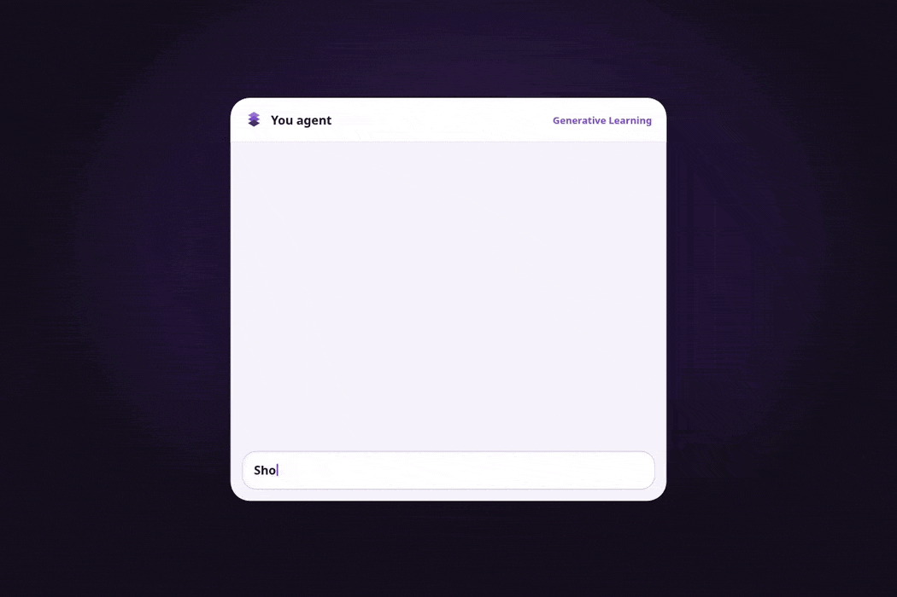
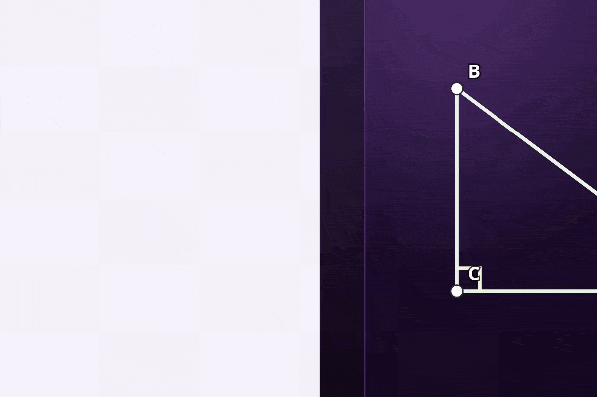

# Generative Learning

**Generate the learning. Not the canvas.**

We build the learning surface once. Your AI agent personalizes the lesson endlessly.

You learn on a chessboard or triangle canvas built for the subject. Your AI agent generates the lesson *inside* that surface. It does not invent a throwaway canvas, and personalizes pace, explanations, and practice in real time.

**[Live demo](https://generative-learning.vercel.app/)**

> Teaching tools work in [Codex on ChatGPT desktop](https://learn.chatgpt.com/docs/webmcp), or in [Chrome](https://www.google.com/chrome/) with `chrome://flags/#enable-webmcp-testing` enabled.

## Working surfaces

### Chess



A persistent board, coach, and chess tools. Open [/chess](https://generative-learning.vercel.app/chess).

### Triangles



GAN constructions, a figure canvas, and triangle tools. Open [/triangles](https://generative-learning.vercel.app/triangles).

## How it works

Each surface registers subject tools on `document.modelContext` (WebMCP). Your AI agent does not build the interface. It creates the lesson inside it, then guides you through it.

```
Home  →  open-page(chess | triangles)
             ↓
      subject surface + tools
             ↓
      your AI agent teaches on that surface
```

### Chess tools

`get-board-state`, `make-move`, `get-possible-moves`, `set-position`, `annotate-board`, `create-lesson`, `add-lesson-step`, `enter-learn-mode`, and others on the chess page.

### Triangle tools

`get-figure-state`, `apply-gan`, `set-figure`, `move-point`, `rotate-figure`, `mark-figure`, `measure-figure`, `create-lesson`, and others on the triangles page.

Home-page tools (`list-pages`, `open-page`) only navigate. Teaching tools appear after that page loads.

## Getting started

```
git clone https://github.com/matipojo/WebMCP-Generative-Learning
cd WebMCP-Generative-Learning
npm install
npm start
```

Open http://localhost:3000 (the home page), then Chess or Triangles.

## Credit

This chess game is based on [React-Chess](https://github.com/szabolcsthedeveloper/React-Chess) by [@szabolcsthedeveloper](https://github.com/szabolcsthedeveloper).
